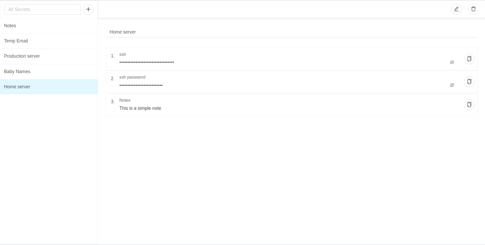

# Titok Vault

A simple app for Managing and accessing secrets.

Need to manage credentials like password, ssh and database connection strings or take quick one line note of something, an address? or copy connection strings, passwords while in a screen sharing calls without showing your colleges your password, Then this is the app you've been looking for! No complicated setup steps needed, just type in what you came for. Comes with autosave, so you will not discard your changes by mistake.

Contains no ads or unnecessary permissions. It is fully opensource and open for new subjection's and ideas to improve the app.

